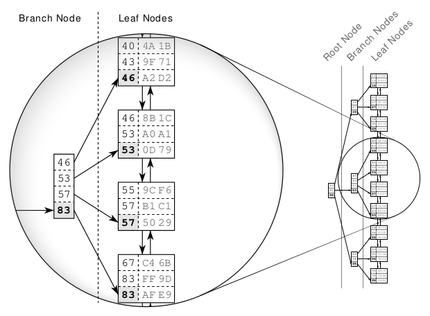
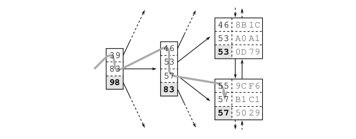

# Anatomy of an Index
“An index makes the query fast” is the most basic explanation of an index I
have ever seen.

An index is a distinct structure in the database that is built using the create index statement. It requires its own disk space and holds a copy of the indexed table data.

Creating an index does not change the table data; it just creates a new data structure that refers to the table. A database index is, after all, very much like the index at the end of a book: it occupies its own space, it is highly redundant, and it refers to the actual information stored in a different place.

Searching in a database index is like searching in a printed telephone directory. The key concept is that all entries are arranged in a well-defined order. Finding data in an ordered data set is fast and easy because the sort order determines each entries position.

A database index is, however, more complex than a printed directory because it undergoes constant change.

An SQL database cannot wait that long. It must process insert , delete and update statements immediately, keeping the index order without moving large amounts of data.

The database combines two data structures to meet the challenge: a doubly linked list and a search tree.
## The Index Leaf Nodes
The primary purpose of an index is to provide an ordered representation of the indexed data. It is, however, not possible to store the data sequentially because an insert statement would need to move the following entries to make room for the new one.

The logical order is established via a doubly linked list. Every node has links to two neighboring entries, very much like a chain. New nodes are inserted between two existing nodes by updating their links to refer to the new node.

The data structure is called a doubly linked list because each node refers to the preceding and the following node. It enables the database to read the index forwards or backwards as needed. It is thus possible to insert new entries without moving large amounts of data—it just needs to change some pointers.

Databases use doubly linked lists to connect the so-called index leaf nodes. Each leaf node is stored in a database block or page; that is, the database’s smallest storage unit.

## The Search Tree (B-Tree)
The index leaf nodes are stored in an arbitrary order —the position on the disk does not correspond to the logical position according to the index order. It is like a telephone directory with shuffled pages. If you search for “Smith” but first open the directory at “Robinson”, it is by no means granted that Smith follows Robinson. A database needs a second structure to find the entry among the shuffled pages quickly: a balanced search tree— in short: the B-tree.

Once created, the database maintains the index automatically. It applies every insert , delete and update to the index and keeps the tree in balance, thus causing maintenance overhead for write operations.

Figure shows an index fragment to illustrate a search for the key “57”. The tree traversal starts at the root node on the left-hand side. Each entry is processed in ascending order until a value is greater than or equal to (>=) the search term (57). In the figure it is the entry 83. The database follows the reference to the corresponding branch node and repeats the procedure until the tree traversal reaches a leaf node.

The tree traversal is a very efficient operation—so efficient that I refer to it as the first power of indexing. It works almost instantly—even on a huge data set. That is primarily because of the tree balance, which allows accessing all elements with the same number of steps, and secondly because of the logarithmic growth of the tree depth. That means that the tree depth grows very slowly compared to the number of leaf nodes.

## Slow Indexes, Part I
Despite the efficiency of the tree traversal, there are still cases where an index lookup doesn’t work as fast as expected.

An index lookup requires three steps: (1) the tree traversal; (2) following the leaf node chain; (3) fetching the table data. The tree traversal is the only step that has an upper bound for the number of accessed blocks—the index depth. The other two steps might need to access many blocks—they cause a slow index lookup.
