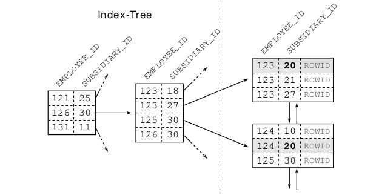

# The Where Clause
The where clause defines the search condition of an SQL statement, and it thus falls into the core functional domain of an index: finding data quickly. Although the where clause has a huge impact on performance, it is often phrased carelessly so that the database has to scan a large part of the index. The result: a poorly written where clause is the first ingredient of a slow query.

## The Equality Operator
The equality operator is both the most trivial and the most frequently used SQL operator. Indexing mistakes that affect performance are still very common and where clauses that combine multiple conditions are particularly vulnerable.

## Primary Keys
We start with the simplest yet most common where clause: the primary key lookup. For the examples throughout this chapter we use the EMPLOYEES table defined as follows:
```sql
CREATE TABLE employees (
employee_id NUMBER
NOT NULL,
first_name
VARCHAR2(1000) NOT NULL,
last_name
VARCHAR2(1000) NOT NULL,
date_of_birth DATE
NOT NULL,
phone_number VARCHAR2(1000) NOT NULL,
CONSTRAINT employees_pk PRIMARY KEY (employee_id)
);
```
The following query uses the primary key to retrieve an employee’s name:
```sql
SELECT first_name, last_name
FROM employees
WHERE employee_id = 123
```
The where clause cannot match multiple rows because the primary key constraint ensures uniqueness of the EMPLOYEE_ID values. The database does not need to follow the index leaf nodes —it is enough to traverse the index tree.

The operation only traverses the index tree. It fully utilizes the logarithmic scalability of the index to find the entry very quickly —almost independent of the table size.

After accessing the index, the database must do one more step to fetch the queried data (FIRST_NAME , LAST_NAME) from the table storage. This operation can become a performance bottleneck —as explained in “Slow Indexes, Part I”— but there is no such risk in connection. This operation cannot deliver more than one entry so it cannot trigger more than one table access. That means that the ingredients of a slow query are not present with an INDEX UNIQUE SCAN.

## Concatenated Indexes
Even though the database creates the index for the primary key automatically, there is still room for manual refinements if the key consists of multiple columns. In that case the database creates an index on all primary key columns — a so-called concatenated index (also known as multi- column, composite or combined index). Note that the column order of a concatenated index has great impact on its usability so it must be chosen carefully.

let’s assume there is a company merger. The employees of the other company are added to our EMPLOYEES table so it becomes ten times as large. There is only one problem: the EMPLOYEE_ID is not unique across both companies. We need to extend the primary key by an extra identifier — e.g., a subsidiary ID. Thus the new primary key has two columns: the EMPLOYEE_ID as before and the SUBSIDIARY_ID to reestablish uniqueness.

The index for the new primary key is therefore defined in the following way:
```sql
CREATE UNIQUE INDEX employee_pk
ON employees (employee_id, subsidiary_id);
```
A query for a particular employee has to take the full primary key into account— that is, the SUBSIDIARY_ID column also has to be used:
```sql
SELECT first_name, last_name
FROM employees
WHERE employee_id = 123
AND subsidiary_id = 30;
```
But what happens when using only one of the key columns, for example, when searching all employees of a subsidiary?

The execution plan reveals that the database does not use the index. Instead it performs a FULL TABLE SCAN . As a result the database reads the entire table and evaluates every row against the where clause. The execution time grows with the table size.

The database does not use the index because it cannot use single columns from a concatenated index arbitrarily.

A concatenated index is just a B-tree index like any other that keeps the indexed data in a sorted list. The first column is the primary sort criterion and the second column determines the order only if two entries have the same value in the first column and so on.

That means that a two-column index does not support searching on the second column alone; that would be like searching a telephone directory by first name.



We could, of course, add another index on SUBSIDIARY_ID to improve query speed. There is however a better solution

The trick is to reverse the index column order so that the SUBSIDIARY_ID is in the first position:
```sql
CREATE UNIQUE INDEX EMPLOYEES_PK
ON EMPLOYEES (SUBSIDIARY_ID, EMPLOYEE_ID);
```
In general, a database can use a concatenated index when searching with the leading (leftmost) columns. An index with three columns can be used when searching for the first column, when searching with the first two columns together, and when searching using all columns.

Even though the two-index solution delivers very good select performance as well, the single-index solution is preferable. It not only saves storage space, but also the maintenance overhead for the second index. The fewer indexes a table has, the better the insert , delete and update performance.

To define an optimal index you must understand more than just how indexes work — you must also know how the application queries the data.
